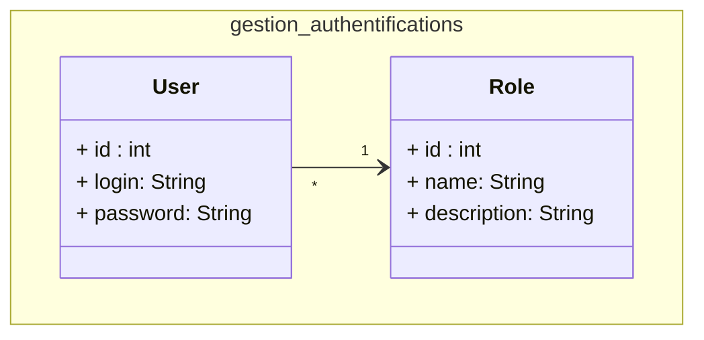

## Conception : Gestion d'authentification

<!-- new slide -->

### Diagramme de classes 

**Figure : Diagramme de classes : Gestion d'authentification**

<!-- new slide -->

<pre class="plantuml">
@startuml
title Use Case Diagram Example
actor Customer
usecase Login
usecase Place Order
usecase Manage Account
Customer -> Login
Customer -> Place Order
Customer -> Manage Account
@enduml

<pre>