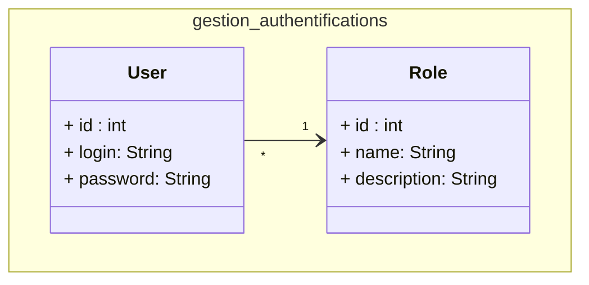

## Conception : Gestion d'authentification

### Diagramme de classes 

```mermaid
classDiagram
namespace gestion_authentifications {
class User {
    + id : int
    + login: String 
    + password: String 

}
class Role{
    + id : int
    + name: String 
    + description: String 
}
}
User "*" --> "1" Role
```
**Figure : Diagramme de classes : Gestion d'authentification**

<!-- new slide -->
