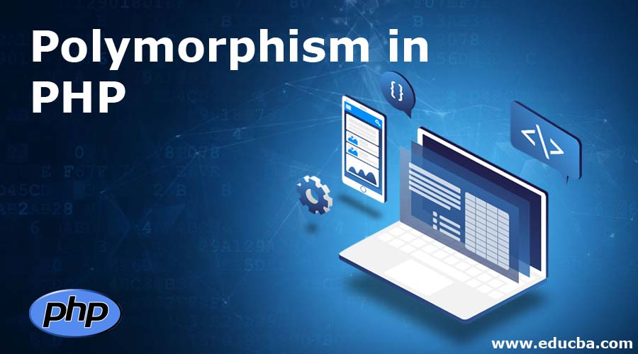
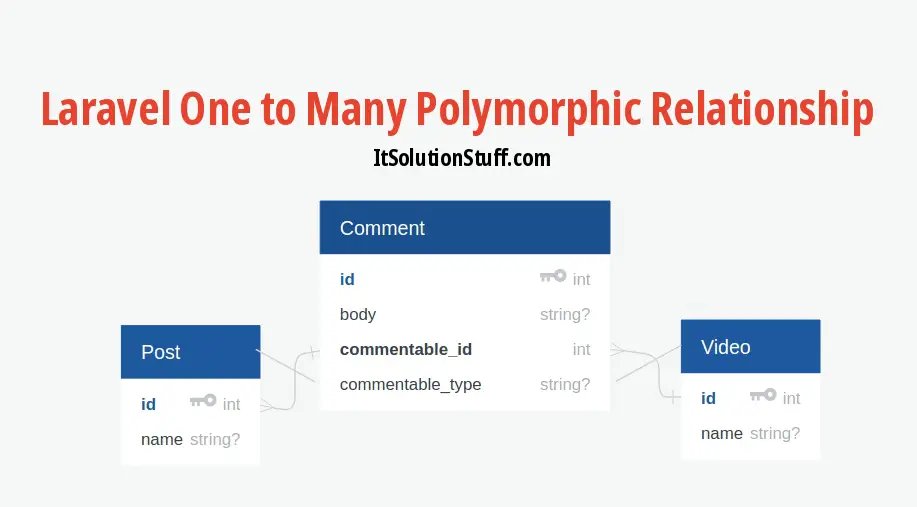

## Heritage

{:width="500px" }
*Heritage*

<!-- note -->

Pour mettre en œuvre l'héritage dans le backend avec Laravel, vous pouvez suivre ces étapes :

- **Définir des modèles Eloquent :** Créez des modèles pour chaque entité de votre application en utilisant Eloquent, le ORM de Laravel. Ces modèles représentent les tables de votre base de données et permettent d'interagir avec elles de manière objet.

- **Établir des relations entre les modèles :** Utilisez les méthodes de relation fournies par Eloquent (telles que belongsTo, hasMany, etc.) pour établir des liens entre les différents modèles, reflétant ainsi la structure hiérarchique de votre application.

- **Créer des contrôleurs dédiés :** Pour encapsuler la logique métier spécifique à chaque classe, créez des contrôleurs dédiés pour chaque type d'entité. Vous pouvez également définir un contrôleur de base générique contenant des méthodes communes à toutes les entités.

- **Utiliser l'héritage pour réutiliser le code :** Étendez le contrôleur de base générique avec des contrôleurs spécifiques à chaque entité. De cette façon, vous pouvez réutiliser le code commun tout en ajoutant des fonctionnalités spécifiques à chaque contrôleur.

- **Favoriser la modularité et la maintenance :** En structurant votre code de cette manière, vous favorisez la modularité et la maintenance facilitée. Les fonctionnalités communes sont regroupées dans un contrôleur de base, ce qui rend les mises à jour et les modifications plus simples à implémenter.

<!-- new slide -->

# Polymorphic

{:width="500px" }
*Polymorphic*

<!-- note -->

La polymorphie en Laravel fait référence à la capacité d'un modèle à appartenir à plusieurs autres modèles sur une seule relation. Cela permet de créer des relations dynamiques entre les modèles, ce qui est particulièrement utile dans des situations où un modèle peut être associé à plusieurs autres modèles sans avoir à définir une relation spécifique pour chaque cas.

<!-- new slide -->

## Example

{:width="500px" }
*Example Polymorphic*

<!-- new slide -->

## Les avantages 

- **Flexibilité et extensibilité :** La polymorphie permet de créer des relations dynamiques entre les modèles, ce qui rend votre application plus flexible et extensible. Vous n'avez pas besoin de définir une relation spécifique pour chaque type de modèle avec lequel vous souhaitez associer un autre modèle.

- **Réutilisabilité du code :** En utilisant la polymorphie, vous pouvez réutiliser le même code pour gérer les relations entre différents types de modèles. Cela réduit la duplication du code et simplifie la maintenance de votre application.

- **Simplicité :** La polymorphie simplifie la gestion des relations entre les modèles en vous permettant de définir une seule relation polymorphe qui peut être associée à plusieurs types de modèles. Cela simplifie la logique de votre application et rend le code plus facile à comprendre.

- **Évolutivité :** En utilisant la polymorphie, votre application est plus évolutive car vous pouvez facilement ajouter de nouveaux types de modèles sans avoir à modifier la structure de votre base de données ou à réécrire une grande partie de votre code.

- **Performance :** La polymorphie peut également contribuer à améliorer les performances de votre application en réduisant le nombre de requêtes nécessaires pour récupérer et manipuler les données. Au lieu d'avoir plusieurs relations spécifiques pour chaque type de modèle, vous utilisez une seule relation polymorphe, ce qui peut réduire la complexité des requêtes et améliorer les performances globales de votre application.

<!-- new slide -->

## Références

- https://laravel.com/docs/10.x/eloquent-relationships
- https://blog.logrocket.com/polymorphic-relationships-laravel/
- https://medium.com/@shaunthornburgh/mastering-polymorphic-relationships-in-laravel-29d10e02a20e

<!-- new slide -->
